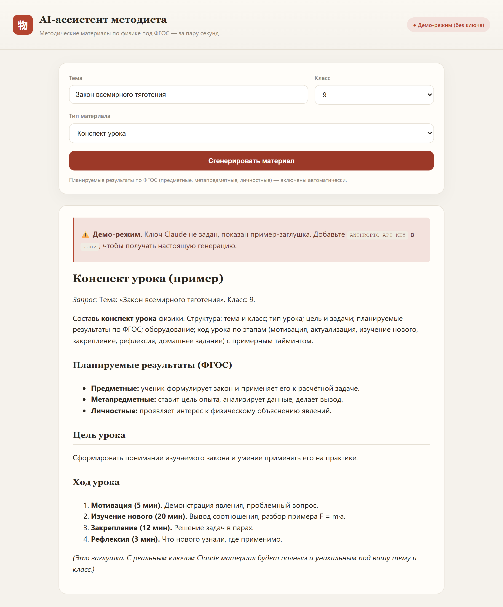

# 🧑‍🏫 AI-ассистент методиста

Веб-инструмент, который составляет методические материалы по физике для российской школы — конспекты уроков, проверочные и лабораторные работы — строго в логике **ФГОС**. Работает на **Claude** (Anthropic).



## 🎯 Зачем

Я несколько лет работал методистом и написал 19 методических пособий полного цикла — по физике, биологии и химии. Составление материала под ФГОС — это каждый раз одна и та же рутина: планируемые результаты трёх видов, цель и задачи, этапы урока, оборудование. Этот проект автоматизирует именно эту рутину: методист задаёт тему, класс и тип материала, а модель собирает готовый черновик в правильной структуре, который остаётся только доработать под себя.

## 🧠 Как это работает

Вся «экспертиза» вынесена в промпты (`app/prompts.py`): системный промпт задаёт роль методиста и требования ФГОС (обязательные предметные / метапредметные / личностные результаты, системно-деятельностный подход), а по типу материала подставляется своя инструкция со структурой. Запрос уходит в Claude через официальный SDK, ответ рендерится из Markdown прямо в браузере.

Провайдер спрятан за одной функцией `generate()` в `app/llm.py` — сменить модель или провайдера можно в одном месте.

```
Форма (тема, класс, тип)
        │
        ▼
  FastAPI  ── build_user_prompt() ──►  Claude (anthropic SDK)
        │                                    │
        ◄──────────── Markdown ──────────────┘
        ▼
  Рендер материала в браузере
```

## ✨ Что умеет

- Три типа материала: **конспект урока**, **проверочная работа**, **лабораторная работа**
- Классы 7–11, тема — любая
- Планируемые результаты по ФГОС включаются автоматически
- **Демо-режим без ключа** — приложение запускается и показывает пример-заглушку, так что его можно посмотреть без API-ключа и без затрат; бейдж в шапке показывает текущий режим

## 🧰 Стек

- **Python 3.12**, FastAPI + uvicorn
- Официальный SDK **`anthropic`**, модель `claude-opus-4-8` (стриминг ответа)
- Ванильный JavaScript + [marked](https://marked.js.org/) для рендера Markdown, без сборки

## 🚀 Запуск

```bash
pip install -r requirements.txt
```

Для реальной генерации создайте `.env` из примера и вставьте ключ:

```bash
cp .env.example .env      # затем впишите ANTHROPIC_API_KEY
```

Запуск (без ключа откроется демо-режим):

```bash
python -m app.main
```

Открыть **http://localhost:8000**.

## 🗂 Структура проекта

```
ai-methodist/
├── app/
│   ├── prompts.py   # системный промпт (ФГОС) + сборка запроса по типу материала
│   ├── llm.py       # провайдер: Claude через SDK или демо-заглушка без ключа
│   └── main.py      # FastAPI: форма, /api/generate, /api/status
├── web/
│   └── index.html   # интерфейс (форма + рендер Markdown)
├── docs/
│   └── screenshot.png
├── .env.example
└── requirements.txt
```

## 📌 Честно о проекте

Это учебный пет-проект. Модель даёт качественный **черновик** — методист всё равно вычитывает и адаптирует материал под свой класс и программу. Что логично развить дальше: экспорт готового материала в `.docx`, история запросов, свои шаблоны структуры под конкретный УМК, поддержка других предметов.
